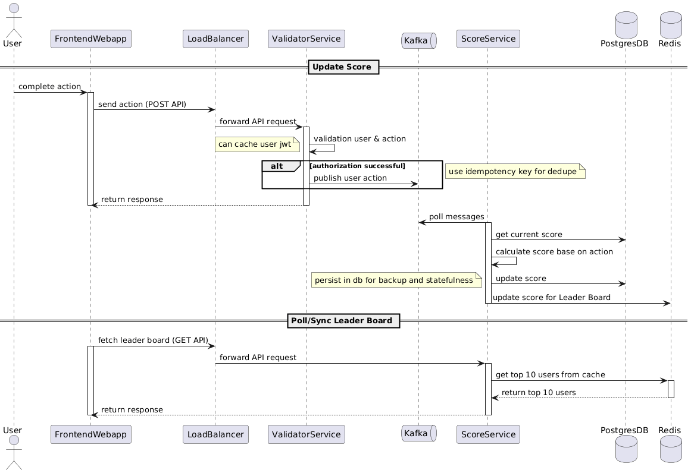

# Leader Board Architecture

## Overview ✅

This module specifies the architecture and execution flow for a Leader Board with requirements as below:
1. We have a website with a score board, which shows the top 10 user’s scores.
2. We want live update of the score board.
3. User can do an action (which we do not need to care what the action is), completing this action will increase the user’s score.
4. Upon completion the action will dispatch an API call to the application server to update the score.
5. We want to prevent malicious users from increasing scores without authorisation.

## Diagram 📊

Click or view the diagram below for an illustrated flow of execution:

> Diagram file: `leaderboard-architecture.png` (located at repository root)

## Flow of Execution (high-level) 🔁

1. Frontend client (webapp) submits a user action → `POST /actions`
2. Load balancer routes the request to the most available instance of server, which in this case is Validator Service (VS).
3. VS validates the API request and user. 
  3.1. If validation fails, user is not authorized, VS returns error response.
  3.2. If validation succeeds, user is authorized, VS publishes a kafka message as the next step and finally returns success response.
4. Once message published to kafka, Score Service (SS) will be polling the messages to process the score. 
  4.1. Score is updated in Postgres DB.
  4.2. Score is updated in Redis Cache, which acts as the source for Leader Board.
5. Frontend client (webapp) will constantly be polling/fetching the Leader Board result from SS and showing them to the users.

## Components & Responsibilities 🔧

- **Load Balancer**: Balance request routing. Use Weighted round robin. We don't use Sticky LB here as we want to keep the server stateless without session ids. Load balancer can also act as the gateway from front-end to back-end with secured connection wrapped in a VPN, which should block external access.
- **Validator Service**: Authentication and authorization, etiher by in-house validation logic or external third-party ie. ForgeRock.
- **Kafka**: Kafka is to handle high throughput. The number of users increases over time which results in thousands or millions of actions per second. Kafka can help maintain an async progress, where the Validator can publish the message to Kafka and finish the API process. In addition, Kafka brings ordering, idempotency, and deduplication for the messages, ensuring the messages are processed in order and avoiding duplicated user actions.
- **Score Service**: Calculate scores base on actions and update to database and cache. 
- **Postgres DB**: Persistent storage for raw scores & snapshots (e.g., PostgreSQL). It can also act as backup when Score Service instances are down, or source for analysis. 
- **Redis Cache**: Fast reads for leaderboard queries with Redis sorted sets. Redis can also be shared among instances of Score Service.

## API Spec (for backend team) 🧾

- `POST /actions`
  - Body: `{ "user_id": "string", "action": string, "timestamp": "ISO8601", ... }`
  - Response: `201 Created`
- `GET /leaderboard`
  - Response: `200 OK` with ordered list of `{ user_id, score, ... }`

## Data Model (suggested)

- `Users(user_id, name, metadata)`
- `Scores(id, user_id, score, timestamp)`
- `Leaderboards(period, user_id, score, rank)`

## Non-functional Requirements ⚙️

- **Latency**: < 100ms for leaderboard reads when cached
- **Throughput**: Handle bursts of score submissions (scale workers horizontally)
- **Durability**: Persist raw events before acknowledging requests
- **Consistency**: Eventual consistency for aggregated leaderboards is acceptable

## Improvements & Notes (actionable) ✨

- Add automated tests around aggregation logic and ranking correctness.
- Implement retries and dead-letter queue for failed events.
- Add metrics: submission rate, processing lag, cache hit ratio, top-k stability.
- Instead of having Score Service persisting user action and score into database right away when consume the message from Kafka, we can have scheduled task or cronjob to sync data from cache to database every now and then.
- Sharding is a blessing in disguise. For cache performance, records can be sharded base on suitable criteria for even faster data access e.g. shard on user ids, or score ranges. However, if there is no score limit, we can shard by user ids, and have a mechanism to publish the top (10) users from every shard and unify them as global top 10 users, in separate (global) cache.